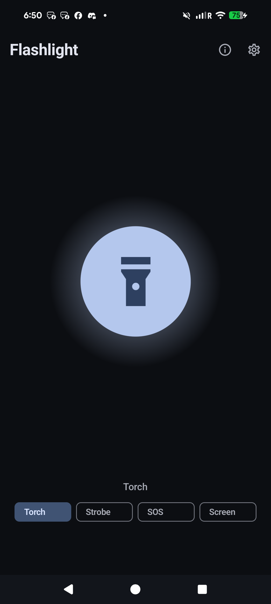
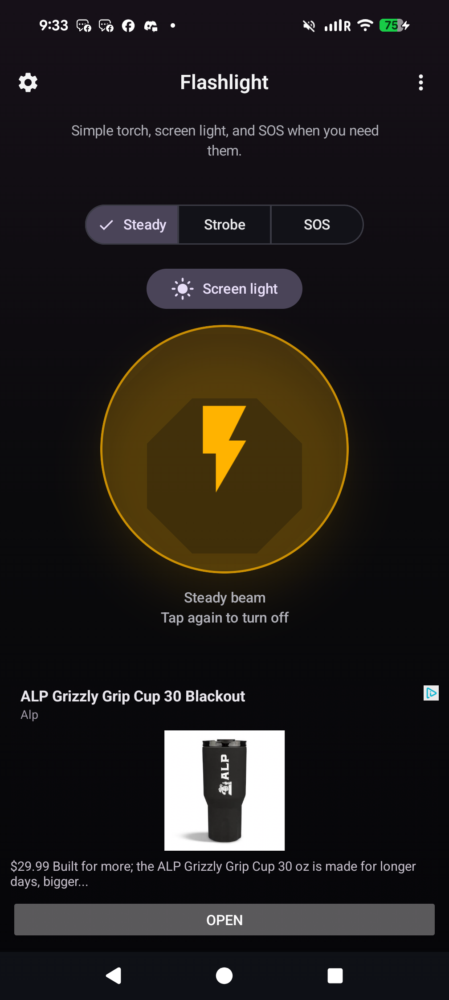
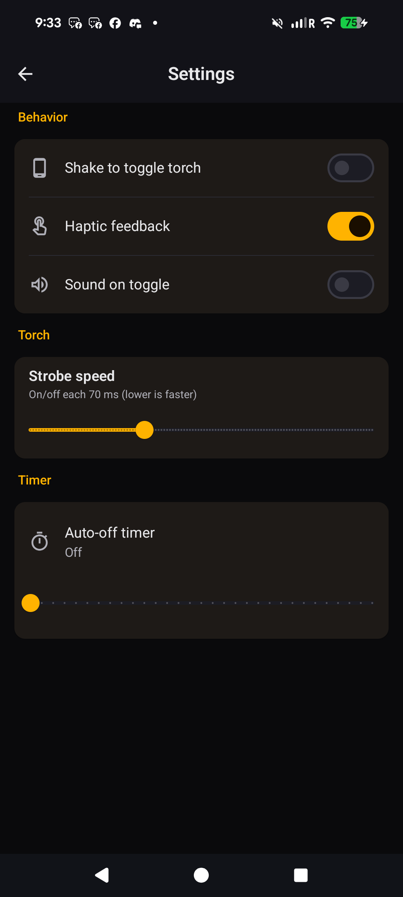
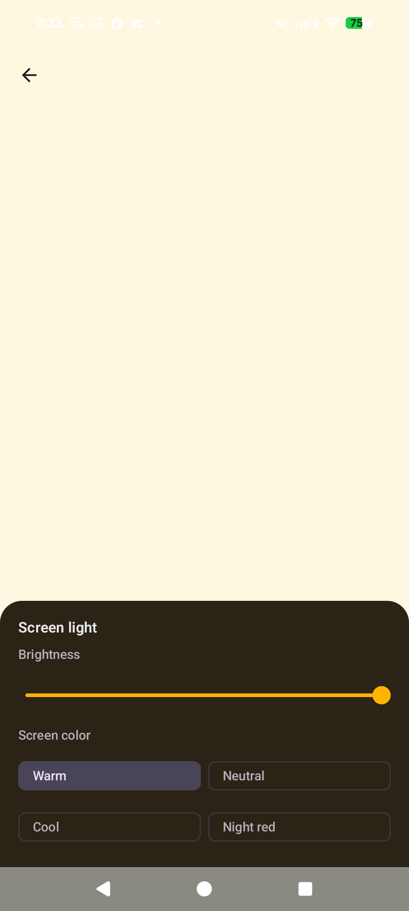
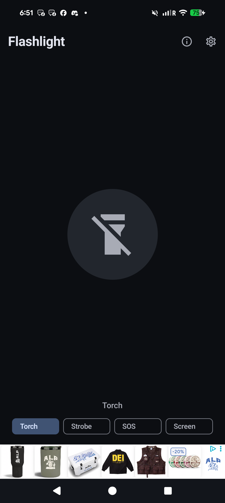

# Flashlight for Android

**Flashlight** is a simple flashlight app for your phone: tap once to turn the LED torch on, tap again to turn it off. The screen stays clean and readable in the dark, so you are not fighting menus when you only need light.

## What you get

- **Instant torch** — big ring toggles the LED; choose **Steady**, **Strobe**, or **SOS**.
- **Screen light** — full-screen panel light with brightness and color presets when you do not want the camera LED.
- **Settings** — shake-to-toggle, haptics, sound, strobe speed, and auto-off timer.
- **Overflow menu** — About, website, privacy, and Buy me a coffee (no clutter on the main screen).
- **Home-screen widget** — open the app or toggle the torch from a widget.

A short ad may appear when you turn the light on; that helps keep the app free to build and ship.

## Screenshots

Real captures from a Pixel 8 Pro (your UI may vary slightly with system theme).

**Home** — top bar (Settings and menu), mode row, screen light button, torch ring, and hints.

**Torch on** — LED on; status line shows mode and optional auto-off countdown.

**Settings** — behavior toggles, strobe speed, and auto-off timer in grouped cards.

**Screen light** — warm fill with brightness slider and color presets.

**Project site** — this marketing page in the mobile browser (same content as GitHub Pages).

## Download the app

**Latest install files (signed APK and Play Store bundle):**  
[https://github.com/chartmann1590/Flashlight/releases/latest](https://github.com/chartmann1590/Flashlight/releases/latest)

Use the **APK** to install directly on your device. Use the **AAB** if you publish to Google Play.

## This page in the browser

**Marketing site:** [https://chartmann1590.github.io/Flashlight/](https://chartmann1590.github.io/Flashlight/)  
Same content you can open from the app’s overflow menu (About / website links)—screenshots, download buttons, and support link.

**Privacy policy:** [https://chartmann1590.github.io/Flashlight/privacy.html](https://chartmann1590.github.io/Flashlight/privacy.html)

---

## Developers

Source and issue tracking: [github.com/chartmann1590/Flashlight](https://github.com/chartmann1590/Flashlight).  
Pushes to `main` build signed release artifacts in GitHub Actions; workflow definitions live under [.github/workflows](.github/workflows/).

